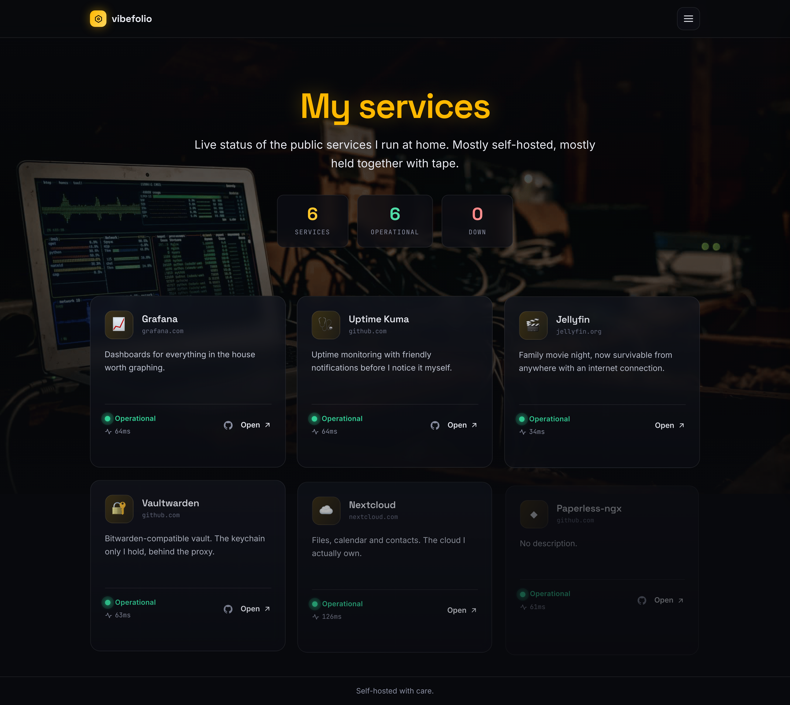

# vibefolio

[](https://github.com/niels-emmer/vibefolio/actions/workflows/ci.yml)
[](LICENSE)

<p align="center">
  
</p>

A lightweight, self-hosted showcase of the public services on **your site** — a
generalised, re-brandable version of the [macjuu.com](https://macjuu.com) services page.
Each service is displayed as a card with an icon, description, URL, and a **live status
indicator** (Up / Down / Unknown). A password-protected **admin panel** lets you configure
site metadata and add / edit / remove services.

The default branding and seed copy are deliberately neutral: set your own site title,
icon, wallpaper and copy in the admin panel (see `docs/decisions.md` D27 for the
generalisation).

Runs as a single Docker container behind **any TLS-terminating reverse proxy of your
choice** — nginx-proxy-manager, Caddy, Traefik, HAProxy, whatever you already run. The
compose file attaches it to an external proxy network (default `proxy-net`, configurable
via `PROXY_NETWORK`) and publishes no ports, so your proxy is the only way in.

## Features

- **Public showcase page** — responsive card grid with live status indicators.
- **Fold-out menu** — one hamburger in the header (same on mobile and desktop) opens a
  slide-out panel with the live status counts (total / online / errors), a **dark / light /
  system theme selector**, the running release name and date, and the admin entry point.
  Under the app name and last-updated date sit the links to the home page, **Credits**, and
  **Feedback** (when the form is enabled).
- **Admin panel** (`/admin`) — a password-protected home for everything below.
- **Services** — add, edit, delete and enable/disable entries; reorder by dragging; upload a
  per-service **icon** (auto-resized) and optionally **capture or upload a thumbnail**; add a
  **GitHub repo link**; and fill in the detail-popup fields (tech stack, AI notes, story,
  audience badge) shown when a card is expanded.
- **Site & appearance** — site title, description, URL and footer; one **accent colour** for
  the whole site; a custom **site icon + favicon** (auto-resized to 64×64 / 32×32 PNGs); and an
  **uploadable wallpaper** with its anchor, size, background colour and transparency.
- **Editable page copy** — the feedback and credits prose, and the credits-page lines, are
  data edited in the panel's **Page text** block, not markup in a template.
- **Feedback form** (`/feedback`) — emails you and stores nothing. Behind a signed timing
  token, a honeypot and a rate limit; off by default.
- **Backup & restore** — everything you have configured in one gzipped JSON file, restorable
  by category. See [Backup & restore](#backup--restore).
- **Automatic health checks** — periodically probes each enabled service URL and records
  status + latency.
- **Secure by default** — Helmet security headers, CSP, httpOnly `SameSite=Strict` session
  cookie, Origin-based CSRF defence, login rate-limiting, constant-time password compare,
  parameterised SQL, input validation, non-root container user.
- **Fast & small** — no build step, no native dependencies, vendored CSS, ~small image.

## Tech stack

| Layer | Choice |
|-------|--------|
| Runtime | Node.js 26 (LTS) |
| Web framework | Express 5 |
| Database | Built-in `node:sqlite` (WAL mode) |
| Auth | DB-backed sessions + httpOnly cookie |
| Frontend | Server-rendered HTML templates (`src/views/*.html`) + vanilla JS, custom "Midnight Glass" design system with self-hosted variable fonts (Space Grotesk, Inter, JetBrains Mono) |
| Container | `node:26-alpine`, multi-stage, non-root |

## Design

The UI is a custom, hand-crafted **"Midnight Glass"** design system — no CSS framework. Dark-first
with an ambient aurora background, glassmorphic cards, gradient accents, animated live status
indicators, and a responsive service grid. Fonts (Space Grotesk / Inter / JetBrains Mono) are
self-hosted variable woff2 files and preloaded for fast rendering.

A light palette ships alongside it, selected with the theme control in the fold-out menu. The
choice is stored in a cookie and rendered server-side into `<html data-theme="…">`, so the
correct theme is in the first byte — no flash — and it applies even on the pages that ship no
fetching JavaScript.

## Quick start (local dev)

```bash
cp .env.example .env        # then edit ADMIN_PASSWORD (and ALLOWED_ORIGINS if needed)
npm install
set -a; source .env; set +a
npm run dev                 # http://localhost:3000 (or whatever PORT you set)
```

**The app reads env vars directly — there is no dotenv auto-load**, so the `source` line is
required or it exits at boot with `Missing required environment variable: ADMIN_PASSWORD`.

Open `http://localhost:3000` for the public page and `http://localhost:3000/admin` for the
admin panel. If something already holds that port (the production container does, on this
machine), start with `PORT=3100 npm run dev`.

## Run with Docker

```bash
cp .env.example .env        # set ADMIN_PASSWORD (and ALLOWED_ORIGINS if needed)
docker compose up -d --build
```

The compose file attaches the container to the external proxy network (the network your
reverse proxy is on; see [`PROXY_NETWORK`](#configuration) below) so the proxy can route to
it by container name. The SQLite database lives in the named Docker volume
**`services-data`** (mounted at `/app/data`), which is why it survives a `docker compose down`
and a rebuild. It is *not* in `./data` — that path is the local-development default
(`DB_PATH`), and the deployment doc has the full picture.

### Reverse proxy

1. Make sure the network your reverse proxy runs on exists and reach the app on it. The
   compose file defaults to `proxy-net`; if yours has another name, set `PROXY_NETWORK` in
   `.env` to it (the network must already exist — compose creates only internal ones).
2. Create a proxy host / route forwarding to **`vibefolio:3000`** — the container's name
   on that network (the `services` in the compose file is the *service* name, which is not
   what the proxy resolves). Terminate TLS there.
3. Set `ALLOWED_ORIGINS` in `.env` to your public origin (e.g. `https://your-domain.example`)
   so the admin API's CSRF origin check passes for browser requests, and `TRUST_PROXY_IP` to
   your proxy's IP on that network so only it can influence rate limiting.
4. For an HTTPS proxy, also set `HSTS_ENABLED=1` in `.env` unless `NODE_ENV=production`
   already gates HSTS on (see the note in `docs/DEVELOPMENT.md`).

## Configuration

All configuration is via environment variables (see `.env.example` for the annotated list):

| Variable | Default | Description |
|----------|---------|-------------|
| `ADMIN_PASSWORD` | — (required) | Password for the admin panel. Rejected at boot in production if it's a placeholder/dev value |
| `PORT` | `3000` | Listen port |
| `DB_PATH` | `./data/services.db` | SQLite database path |
| `HEALTH_CHECK_INTERVAL` | `60` | Seconds between health checks |
| `HEALTH_CHECK_TIMEOUT` | `5000` | Per-request health-check timeout (ms) |
| `HEALTH_ALLOW_PRIVATE` | `0` | Set `1` to allow health checks to private/loopback hosts (LAN services). Default blocks them (SSRF protection) |
| `SESSION_TTL_HOURS` | `12` | Session lifetime (hours) |
| `LOGIN_RATE_LIMIT` | `10` | Max login attempts per IP per 15 minutes |
| `ALLOWED_ORIGINS` | — | Comma-separated origins allowed for admin API (CSRF) |
| `PROXY_NETWORK` | `proxy-net` | The external Docker network your reverse proxy is on (used by `docker-compose.yml` only; the network itself must already exist) |
| `TRUST_PROXY_IP` | — | The reverse-proxy IP trusted for `X-Forwarded-For`. Set it so only that peer can influence rate limiting |
| `BACKUP_DIR` | beside the DB | Where pre-restore snapshots are written. Inside the data volume in the container |
| `HSTS_ENABLED` | `0` | Opt in to `Strict-Transport-Security` outside production. Only meaningful over TLS — see the note in `docs/DEVELOPMENT.md` |
| `BROWSERLESS_URL` / `BROWSERLESS_TOKEN` | — | The screenshot service used to capture service thumbnails |
| `FEEDBACK_TOKEN_SECRET` | random per boot | Signing key for the feedback form's timing token. Set it to keep tokens valid across restarts |
| `FEEDBACK_TOKEN_TTL_MINUTES` | `60` | How long a visitor may take to fill the form |
| `FEEDBACK_MIN_SECONDS` | `3` | Minimum seconds between page load and submit |
| `FEEDBACK_RATE_LIMIT` | `5` | Feedback submissions allowed per IP per window |
| `NODE_ENV` | — | `production` enables secure cookies, gates HSTS, and rejects placeholder passwords |

## Backup & restore

*Download backup* writes everything this deployment has configured into a single gzipped JSON
file: the site settings, the services (with their uploaded icons and thumbnails, which live in
the database as base64), the page copy, the credit lines, and the email settings. *Restore from
a backup* is a two-step dialog — confirm, pick a file, then choose which categories to overwrite.

- **Seven categories:** site settings, page copy, site icon & favicon, wallpaper, email &
  feedback, services, and credit lines. Restore **replaces** the selected categories rather than
  merging, and applies them in one transaction.
- **Nothing secret travels.** The SMTP password is never in an archive, and neither are the
  sessions table or the one-time seed markers.
- **Validated before anything is written.** The upload is decompressed, parsed and fully checked
  first; a file that could not be restored is refused while nothing has been staged.
- **Undoable.** A snapshot of the current state is written before every restore and listed in
  the panel, so a regretted restore is reversible through the same dialog.

Design rationale in [`docs/decisions.md` D25](docs/decisions.md).

## API

### Public (no auth)

- `GET /api/site` — site metadata, the accent, the wallpaper placement, and `hasIcon` /
  `hasWallpaper` booleans.
- `GET /api/services` — enabled services with live status.
- `GET /api/feedback/token` — a signed timing token for the feedback form.

### Public write

- `POST /api/feedback` — the feedback form's only write. Rate-limited, token- and
  honeypot-guarded; sends email and stores nothing.

### Public images (stored in the DB, served as PNG)

- `GET /site-icon.png`, `GET /favicon.png`
- `GET /wallpaper.jpg` — the uploaded background
- `GET /service-icon/:id.png`, `GET /service-thumb/:id.png` — 404 for a disabled service

### Pages

- `GET /`, `/credits`, `/feedback`, `/admin` — server-rendered
- `GET /index.html` → 301 to `/`

### Admin (session cookie required)

Auth: `POST /api/admin/login`, `POST /api/admin/logout`, `GET /api/admin/me`

- **Services** — `GET|POST /api/admin/services`, `PUT|DELETE /api/admin/services/:id`,
  `PUT /api/admin/services/order`, `PUT /api/admin/services/:id/icon`,
  `PUT /api/admin/services/:id/thumbnail`, `POST /api/admin/services/:id/thumbnail/capture`
- **Site** — `GET|PUT /api/admin/settings`, `PUT|DELETE /api/admin/icon`,
  `PUT|DELETE /api/admin/wallpaper`
- **Page copy** — `GET|PUT /api/admin/content`, `POST /api/admin/credits`,
  `PUT|DELETE /api/admin/credits/:id`, `PUT /api/admin/credits/order`
- **Feedback / email** — `GET|PUT /api/admin/email`, `POST /api/admin/email/test-connection`,
  `POST /api/admin/email/test-send`
- **Backup & restore** — `GET /api/admin/backup`,
  `GET /api/admin/backup/snapshots[/:name]`, `POST /api/admin/restore/inspect`,
  `POST /api/admin/restore/apply`, `POST /api/admin/restore/discard`

Full request/response shapes are in [`docs/ARCHITECTURE.md`](docs/ARCHITECTURE.md).

## Tests

```bash
npm test
```

Runs integration tests against an in-memory database covering auth, CRUD, validation, and
settings.

## Agentic development

This app was built with [OpenCode](https://opencode.ai) running **DeepSeek V4.1 Flash** — the
agent wrote the code, the tests and these docs, and checked its own work against a live dev
server and the test suite.

The repository is deliberately set up so another agent (or you) can pick it up and change it
without hand-holding:

- **[`AGENTS.md`](AGENTS.md)** is the entry point. It carries the architecture map, the
  conventions, and the traps that actually bit this codebase — the CSP rules, the drawer's
  `transform`/`inert` requirement, bumping `ASSET_VERSION`, and the seed-once migration
  semantics. Point an agent at it and it can debug, extend or rework the framework on its own.
- **[`docs/decisions.md`](docs/decisions.md)** records every architectural decision as a
  numbered entry — the *why*, and what was rejected — so settled ground is not re-litigated.
- **The test suite** (`npm test`) is the guardrail: an agent can prove a change end to end
  before claiming it works, and CI runs the same suite (plus a dependency audit) on every push
  and pull request.
- **[`SECURITY.md`](SECURITY.md)** states the threat model and the accepted risks, so an agent
  touching auth, the health checker or the backup path knows the boundaries it must not cross.

In practice: fork it, open it in OpenCode, and ask for a new feature, a different design system,
or an integration — the instructions, the rationale and the checks are already in the repo.

## Security notes

- Secrets are never committed; they come from the environment.
- The container runs as a non-root user and the DB lives on a volume.
- The admin API is protected by a session cookie (`httpOnly`, `SameSite=Strict`, `secure` in
  production) plus an Origin allow-list check.
- Login is rate-limited to mitigate brute-force attempts.
- All SQL is parameterised; all user input is validated and HTML-escaped on render.

## License

MIT
